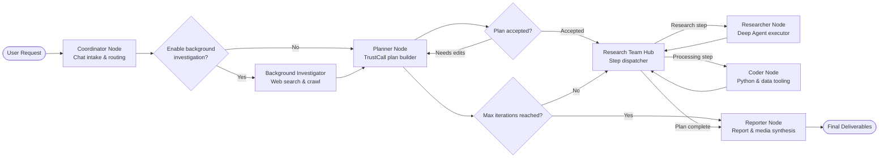
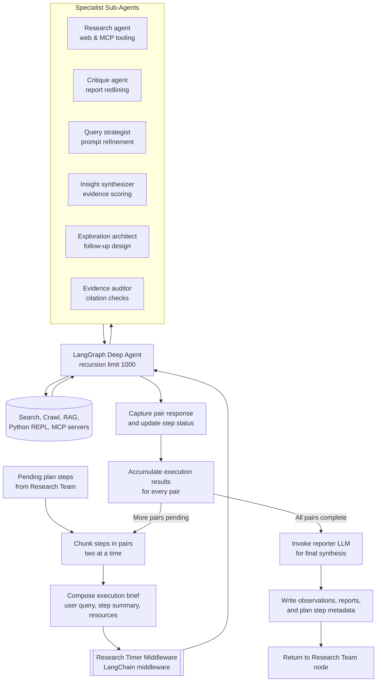

# Morgana Architecture Schemas

This document visualizes the end-to-end LangGraph workflow that powers Morgana and the inner workings of the deep-agent execution loop.

## Workflow Orchestration (Top-Level Graph)

### Key Highlights

- **Configuration-driven:** `Configuration.from_runnable_config` injects max iterations, search caps, MCP servers, and research budgets into every node.
- **Human-in-the-loop hooks:** `interrupt()` pathways let reviewers approve (`[ACCEPTED]`) or revise (`[EDIT PLAN]`) plans before execution.
- **State persistence:** LangGraph checkpoints preserve plans, observations, and artifacts between node transitions and replays.
- **Multiple execution paths:** The planner can jump directly to the reporter when a plan has enough context, or loop until max iterations are hit.

## Deep Agent Execution Loop

### Deep Agent Highlights

- **Pair-wise execution:** `_execute_deepagent_step` batches plan steps in twos, giving the model a fresh brief every cycle to limit context drift.
- **Resource-aware prompting:** When resource files are present, a local-search reminder is injected before each deep-agent call.
- **Timer middleware:** `ResearchTimerMiddleware` (LangChain middleware) alerts the agent as time elapses, nudging it to conclude or abort runaway loops.
- **Rich tool surface:** MCP-delivered tools and built-ins (search, crawl, RAG, Python) are dynamically attached per configuration.
- **Final synthesis:** After all pairs, Morgana replays the accumulated findings through the reporter LLM to produce the polished final deliverable.
